  
  

  
  
  ## I'm Nafiul
  

## 🛠️ Tech Stack

### AI & Machine Learning

### Language

### Data Science

### Visualization

### Cloud & Development Tools

 

---

  

  
  

---

  

  
  

## 📊 Contribution Graph

  

## 🏆 GitHub Trophies

## 🌐 Connect

 

  
